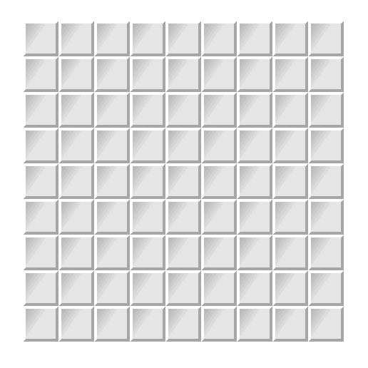
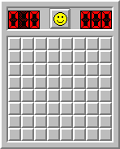

{:.centered-image.with-max-height}

It's no secret that JavaScript is everywhere. It's been around for over 20
years, and due to its accessibility and ease of use, it's expanded and evolved
in unimaginable ways. It can be used to build not only interactive web
applications, but also [server tools][node], [desktop apps][electron],
[interactive graphs][d3], [three-dimensional scenes][three-js], and even
[virtual reality experiences][aframe].

[node]: https://nodejs.org/en/
[electron]: https://electron.atom.io/
[d3]: https://d3js.org/
[three-js]: https://threejs.org/
[aframe]: https://aframe.io/

Whether you're an aspiring or seasoned developer, you know that JavaScript needs
to be a fixture in your programming toolbelt. But with the
[cornucopia][npm-package-list] of reusable tools available and the [never-ending
shift][javascript-daily] of what's hot and what's not, it's easy to get [lost
and overwhelmed][javascript-fatigue].

That's why, over the course of the next several blog posts, we're going to get
back to basics and spend time building a small project using simple building
blocks. There will be no mention of cutting-edge libraries, frameworks, or
precompilers up front.

[npm-package-list]: http://alexandros.resin.io/npm-now-the-largest-module-repository/
[javascript-daily]: https://twitter.com/javascriptdaily
[javascript-fatigue]: https://medium.com/@ericclemmons/javascript-fatigue-48d4011b6fc4

**What we'll be making is a game called [Minesweeper]**. (In fact, the animation
at the top of this post is what we'll end up with.) You may have heard of it;
for a long time, it was included on every Windows computer. Even if you are
unfamiliar with the game, don't worry. The rules are simple, and there are no
animations or complicated logic for us to implement.

[Minesweeper]: http://www.minesweeper.info/wiki/Windows_Minesweeper

### The game


{:.floating-image}

Minesweeper is played on a square board of spaces, and the game starts with a
set number of mines scattered in secret across it. (In the Beginner version, the
size of the board is 9x9 and there are 10 mines.) The player uncovers spaces by
clicking on them. Uncovering a space has three possible outcomes depending on
the true identity of the space:

* If any of the spaces that surround the space is a mine, the number of mines
  is counted and displayed inside the space.
* If none of the surrounding spaces are mines, no number is displayed inside the
  space. However, any surrounding spaces that have no surrounding mines
  themselves are uncovered, then *their* surrounding spaces that have no
  surrounding mines are uncovered, and so forth and so on.
* If the space is a mine, all of the mines are uncovered and the game ends.

The player wins, then, by managing to uncover all of the spaces around mines
without actually triggering any of them.

### An overview of this series

If you're getting started in web development, or if you haven't kept up with all
of the updates that have been made to JavaScript in a while, then this series is
for you! Here are the topics that we'll cover:

* Using HTML and CSS to display the game board statically
* Using [jQuery][]{:target="_blank"} to render the game board
* Implementing the core game logic
* Refactoring code into functions and classes
* Using ES2017 (and understanding how it differs from ES5)
* Replacing jQuery with the [JavaScript DOM API][]{:target="_blank"}
* Writing tests for the game using [Jest][]{:target="_blank"}
* Splitting the game logic and data from the display code
* Substituting the view layer with React
* Bonus: Implementing the game using Ember and Angular

[jQuery]: http://jquery.com
[JavaScript DOM API]: https://www.w3.org/TR/html51/dom.html
[Jest]: https://facebook.github.io/jest/

### What you'll need to know

Before we get started, there are a few prerequisites.

First, since I'm going to focus on JavaScript in this series, I have to make the
assumption that you have some understanding of HTML and CSS already. If you need
a refresher, [Khan Academy][intro-to-html-and-css]{:target="_blank"} has a great
course that you can follow.

[intro-to-html-and-css]: https://www.khanacademy.org/computing/computer-programming/html-css

Second, although I'll be introducing concepts along the way, I recommend that
you have a basic comprehension of JavaScript as well -- variables, functions,
and the like. Again, [Khan Academy][intro-to-javascript]{:target="_blank"} is a
great resource here.

[intro-to-javascript]: https://www.khanacademy.org/computing/computer-programming/programming

Finally -- and this is the most important thing -- as you read this series, I
highly encourage you to create a project and follow along closely. Every once in
a while I'll give you a wall of code you'll need to copy and paste, but for the
most part, I expect you to be in the driver's seat writing the code by hand.
You'll learn better this way, and anyway, it should be a lot more fun.

With that out of the way, let's start making the game!

---

### Starting small

You'll want to make a directory in wherever you keep code and open that up in
whichever editor you're using. Give the directory a meaningful name like
`minesweeper`, and create two files in it, `minesweeper.html` and
`minesweeper.css`. This will be our project for the entire series, and it should
look like this:

<ul class="file-tree">
  <li class="directory"><span>minesweeper/</span><ul>
      <li class="file">minesweeper.html</li>
      <li class="file">minesweeper.css</li>
    </ul>
  </li>
</ul>

The first thing we need to do is to display the board. There are multiple ways
to do this, but we don't want to have to write a bunch of CSS; tables will work
just fine. Open `minesweeper.html` and add the following:

``` html
<!DOCTYPE html>
<html>
  <head>
    <title>Minesweeper</title>
    <link rel="stylesheet" href="minesweeper.css">
    <script src="minesweeper.js"></script>
  </head>

  <body>
    <table id="board">
      <tr>
        <td></td>
        <td></td>
        <td></td>
        <td></td>
        <td></td>
        <td></td>
        <td></td>
        <td></td>
        <td></td>
      </tr>
      <tr>
        <td></td>
        <td></td>
        <td></td>
        <td></td>
        <td></td>
        <td></td>
        <td></td>
        <td></td>
        <td></td>
      </tr>
      <tr>
        <td></td>
        <td></td>
        <td></td>
        <td></td>
        <td></td>
        <td></td>
        <td></td>
        <td></td>
        <td></td>
      </tr>
      <tr>
        <td></td>
        <td></td>
        <td></td>
        <td></td>
        <td></td>
        <td></td>
        <td></td>
        <td></td>
        <td></td>
      </tr>
      <tr>
        <td></td>
        <td></td>
        <td></td>
        <td></td>
        <td></td>
        <td></td>
        <td></td>
        <td></td>
        <td></td>
      </tr>
      <tr>
        <td></td>
        <td></td>
        <td></td>
        <td></td>
        <td></td>
        <td></td>
        <td></td>
        <td></td>
        <td></td>
      </tr>
      <tr>
        <td></td>
        <td></td>
        <td></td>
        <td></td>
        <td></td>
        <td></td>
        <td></td>
        <td></td>
        <td></td>
      </tr>
      <tr>
        <td></td>
        <td></td>
        <td></td>
        <td></td>
        <td></td>
        <td></td>
        <td></td>
        <td></td>
        <td></td>
      </tr>
      <tr>
        <td></td>
        <td></td>
        <td></td>
        <td></td>
        <td></td>
        <td></td>
        <td></td>
        <td></td>
        <td></td>
      </tr>
    </table>
  </body>
</html>
```

To make a board look like a board, we'll also want to add some minimal CSS.
We'll set the board to a reasonable size and add some visual feedback to each
cell when it's hovered over. Open `minesweeper.css` and add:

``` css
#board {
  width: 400px;
  height: 400px;
}

td {
  border: 1px solid black;
  cursor: pointer;
}

td:hover {
  background-color: #ddd;
}
```

Great! Let's [take a look][minesweeper-1]{:target="_blank"} at what we have so
far:

[minesweeper-1]: ../demos/minesweeper-1/minesweeper.html

<iframe src="../demos/minesweeper-1/minesweeper.html"></iframe>

### What's next

We started out by coding the board using straight HTML. Down the road, though,
it will be better if the board is generated using JavaScript. In the [next
post][minesweeper-2] we'll add jQuery into the project, which will make our job
easier.

[minesweeper-2]: ./minesweeper-2.html.md
